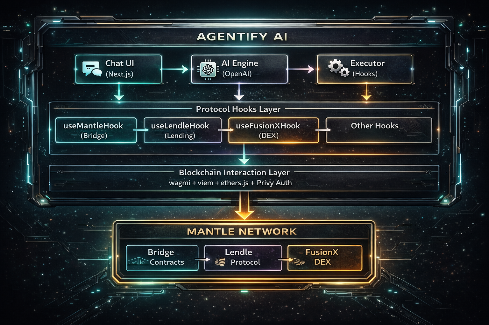

<p align="center">
  
  
  
  
</p>

<h1 align="center">Agentify AI</h1>

<h3 align="center">The AI-Powered DeFi Command Center for Mantle Network</h3>

<p align="center">
  <a href="https://agentify-mantle.vercel.app">Live Demo</a> •
  <a href="#demo-video">Demo Video</a> •
  <a href="#features">Features</a> •
  <a href="#try-it-yourself">Try It Yourself</a> •
  <a href="#mantle-integrations">Integrations</a>
</p>

---

## TL;DR (For Judges)

**Agentify AI** is a production-ready, mainnet-deployed AI agent that lets users **bridge, lend, borrow, stake, swap, wrap/unwrap tokens, and add liquidity** on Mantle using natural language.

### Why It Wins:

| | |
|---|---|
| **Built Natively on Mantle Mainnet** | Not a testnet demo - real contracts, real assets, real users |
| **Deep Protocol Integration** | Mantle Bridge + Lendle + FusionX DEX fully orchestrated |
| **AI-Driven Multi-Step Execution** | Intent → Validation → Execution → Recovery loop |
| **Conversational DeFi UX** | Replace complex dashboards with simple dialogue |
| **7 Core DeFi Operations** | Bridge, Wrap/Unwrap, Lend, Borrow, Stake, Swap, Add Liquidity |

```
"I want to lend 0.0005 ETH in Mantle"
```

One command. AI handles approval + transaction automatically. Zero UI complexity.

**[Try Live Demo →](https://agentify-mantle.vercel.app)**

---

## Why Mantle?

Agentify AI is built **specifically for Mantle** because:

| Mantle Advantage | How Agentify Leverages It |
|------------------|---------------------------|
| **Ultra-Low Gas Fees** | Makes multi-step AI-driven transactions economically viable |
| **Fast Finality** | Enables real-time conversational DeFi UX |
| **Native Protocols** | Deep composability with Lendle, FusionX, and Mantle Bridge |
| **Modular Architecture** | Aligns perfectly with agent-based execution patterns |
| **Growing Ecosystem** | Positions Agentify as the gateway for new users |

**Agentify turns Mantle into the first truly conversational DeFi ecosystem.**

---

## What's Novel Here?

This isn't just protocol integration. Agentify introduces:

| Innovation | Description |
|------------|-------------|
| **AI-Driven Transaction Orchestration** | Multi-step DeFi operations from single natural language commands |
| **Intent → Validation → Execution Loop** | Smart validation before every on-chain action |
| **Conversation-Aware Actions** | Follow-ups, partial commands, context memory across sessions |
| **Agent Abstraction Layer** | Unified interface over Bridge + Lending + DEX protocols |
| **Error Recovery System** | Intelligent failure handling with user-friendly explanations |
| **Dashboard Without Dashboards** | Complete DeFi UX through dialogue, not complex UIs |

**We're not building another DeFi frontend. We're building the interface layer that makes DeFi accessible to everyone.**

---

## Try It Yourself

### Quick Test Commands (Copy & Paste)

Open [agentify-mantle.vercel.app](https://agentify-mantle.vercel.app), connect your wallet, and try:

**Bridge & Wrap**
```
I want to bridge 0.001 ETH from Ethereum to Mantle
Can you wrap 1 MNT in Mantle?
Show my MNT balance
```

**Lendle - Lend & Borrow**
```
I want to lend 0.0005 ETH in Mantle
Can I borrow 0.5 MNT?
I want to repay 0.5 MNT
Show my Lendle data
Withdraw my 0.0003 ETH from Lendle
```

**Lendle - Staking**
```
Show my Lendle Rewards
I want to stake 60 LEND in Mantle
Unstake 50 LEND
Show my staking rewards
```

**FusionX - Swaps**
```
Swap 0.0003 ETH to USDT in Mantle using FusionX
Swap 1 USDT to USDC in Mantle using FusionX
```

**FusionX - Liquidity**
```
I want to add liquidity to WMNT and WETH pool in Mantle (0.5 WMNT and 0.0002 WETH)
Show my liquidity balance for WMNT WETH
Close my all liquidity positions
```

Each command triggers multi-step execution: AI handles token approvals + transactions automatically.

---

## Core Features

### 7 DeFi Operations, One Interface

| Operation | Protocol | What It Does |
|-----------|----------|--------------|
| **Bridge** | Mantle Bridge | Transfer assets between Ethereum ↔ Mantle |
| **Wrap/Unwrap** | Mantle Bridge | Convert MNT ↔ WMNT for DeFi compatibility |
| **Lend** | Lendle | Deposit assets to earn yield |
| **Borrow** | Lendle | Take loans against your collateral |
| **Stake** | Lendle | Stake LEND tokens for protocol rewards |
| **Swap** | FusionX DEX | Exchange tokens with optimal routing |
| **Add Liquidity** | FusionX DEX | Provide liquidity to pools and earn fees |

### AI Agent Capabilities

| Feature | Description |
|---------|-------------|
| **Natural Language Processing** | Understands complex DeFi intents from plain English |
| **Multi-Step Execution** | Handles approvals, transactions, and confirmations automatically |
| **Real-Time Feedback** | Live transaction status updates and confirmations |
| **Error Recovery** | Intelligent error handling with user-friendly explanations |
| **Context Awareness** | Remembers conversation history for follow-up commands |
| **Balance Validation** | Checks balances before executing to prevent failed transactions |

### Comprehensive Dashboard

- **Agent Usage Analytics**: Visual charts of command distribution
- **Transaction History**: Complete activity log with status tracking
- **Gas Spend Monitoring**: Track transaction costs over time
- **Portfolio Overview**: Unified view of all DeFi positions

---

## Mantle Integrations

### 1. Mantle Bridge - Cross-Chain Asset Transfer

**Deposit (L1 → Mantle)**
- Bridge MNT from Ethereum to Mantle
- Bridge ETH to Mantle (wraps to WETH)
- Bridge ERC-20 tokens

**Withdraw (Mantle → L1)**
- Initiate withdrawal
- Prove withdrawal after challenge period
- Finalize and claim on L1

**Wrap/Unwrap**
- Convert native MNT to WMNT for DeFi protocols
- Unwrap WMNT back to MNT

**Example Commands:**
```
"I want to bridge 0.001 ETH from Ethereum to Mantle"
"Can you wrap 1 MNT in Mantle?"
"Show my MNT balance"
```

---

### 2. Lendle Protocol - Lending & Borrowing

**Lending Operations**
- **Deposit**: Supply assets to earn yield
- **Withdraw**: Remove deposited assets
- **Borrow**: Take loans against collateral
- **Repay**: Pay back borrowed amounts

**Staking**
- Stake LEND tokens for rewards
- Unstake and claim rewards
- View staking APY

**Supported Assets**: WMNT, WETH, USDC, USDT, mETH, WBTC

**Example Commands:**
```
"I want to lend 0.0005 ETH in Mantle"
"Can I borrow 0.5 MNT?"
"I want to repay 0.5 MNT"
"Show my Lendle data"
"Withdraw my 0.0003 ETH from Lendle"
"I want to stake 60 LEND in Mantle"
"Unstake 50 LEND"
"Show my staking rewards"
```

---

### 3. FusionX DEX - Token Swaps & Liquidity

**Swap Features**
- V2 & V3 AMM Swaps
- Smart routing for optimal rates
- Configurable slippage protection

**Liquidity Provision**
- Add liquidity to V2 and V3 pools
- Remove liquidity positions
- View LP token balances
- Multiple fee tiers (0.01%, 0.05%, 0.30%, 1.00%)

**Example Commands:**
```
"Swap 0.0003 ETH to USDT in Mantle using FusionX"
"Swap 1 USDT to USDC in Mantle using FusionX"
"I want to add liquidity to WMNT and WETH pool in Mantle (0.5 WMNT and 0.0002 WETH)"
"Show my liquidity balance for WMNT WETH"
"Close my all liquidity positions"
```

---

## Demo Video

<p align="center">
  <a href="https://youtube.com/watch?v=YOUR_VIDEO_ID">
    
  </a>
</p>

**[Click to watch 4-minute demo →](https://youtube.com/watch?v=YOUR_VIDEO_ID)**

---

## Architecture

<p align="center">
  
</p>

### Tech Stack

| Layer | Technology |
|-------|------------|
| **Frontend** | Next.js 16, React 18, TypeScript |
| **Styling** | Tailwind CSS, Radix UI |
| **State** | Zustand, React Context |
| **Blockchain** | wagmi 2.16, viem 2.33, ethers.js 5.8 |
| **Authentication** | Privy (Multi-wallet + Social Login) |
| **AI Engine** | OpenAI GPT-4 |
| **Backend** | Python Flask (Agent Orchestration) |

---

## Usage Examples

### Bridge Assets

```
User: "I want to bridge 0.001 ETH from Ethereum to Mantle"

Agentify: I'll help you bridge 0.001 ETH to Mantle Network.

✓ Checking ETH balance on Ethereum... 0.5 ETH available
✓ Estimating gas fees...
✓ Initiating bridge transaction...
✓ Transaction submitted: 0x1234...abcd

Your 0.001 ETH will arrive on Mantle in ~10-15 minutes.
```

### Lend on Lendle

```
User: "I want to lend 0.0005 ETH in Mantle"

Agentify: I'll deposit your ETH into Lendle Protocol.

✓ Checking ETH balance... 0.01 ETH available
✓ Approving ETH for Lendle... (Step 1/2)
✓ Transaction confirmed!
✓ Depositing 0.0005 ETH... (Step 2/2)
✓ Transaction confirmed: 0xabcd...1234

Successfully deposited 0.0005 ETH into Lendle!
```

### Swap on FusionX

```
User: "Swap 0.0003 ETH to USDT in Mantle using FusionX"

Agentify: I'll swap your ETH for USDT on FusionX.

✓ Checking ETH balance... 0.01 ETH available
✓ Finding best rate...
✓ Approving ETH... (Step 1/2)
✓ Executing swap... (Step 2/2)
✓ Transaction confirmed!

Swapped 0.0003 ETH → 0.85 USDT
```

### Add Liquidity

```
User: "I want to add liquidity to WMNT and WETH pool in Mantle (0.5 WMNT and 0.0002 WETH)"

Agentify: I'll add liquidity to the WMNT/WETH pool.

✓ Checking balances...
✓ Approving WMNT... (Step 1/3)
✓ Approving WETH... (Step 2/3)
✓ Adding liquidity... (Step 3/3)
✓ Transaction confirmed!

Successfully added liquidity to WMNT/WETH pool.
```

---

## Roadmap

| Phase | Status | Milestones |
|-------|--------|------------|
| **Phase 1: Foundation** | ✅ Complete | Mantle mainnet deployment, Core AI agent, Bridge + Lendle + FusionX integration |
| **Phase 2: Enhancement** | In Progress | Yield optimization strategies, Portfolio analytics, Advanced risk management |

---

## Team

**Agentify AI** is built by [Teckas Technologies](https://www.teckastechnologies.com/), a team with deep expertise in:

- Web3 infrastructure & DeFi protocol integrations
- AI agent systems & natural language processing
- Production-grade fintech applications
- Cross-chain interoperability solutions

---

## Getting Started

### Prerequisites

- Node.js 18+
- pnpm (recommended) or npm
- MetaMask or any Web3 wallet

### Installation

```bash
# Clone the repository
git clone https://github.com/Teckas-Technologies/agentify-mantle.git
cd agentify-mantle

# Install dependencies
pnpm install

# Set up environment variables
cp .env.example .env.local

# Run development server
pnpm dev
```

Open [http://localhost:3000](http://localhost:3000) to see the app.

---

## Links

| Resource | Link |
|----------|------|
| **Live Demo** | [agentify-mantle.vercel.app](https://agentify-mantle.vercel.app) |
| **Demo Video** | [YouTube](https://youtube.com/watch?v=YOUR_VIDEO_ID) |
| **GitHub** | [Teckas-Technologies/agentify-mantle](https://github.com/Teckas-Technologies/agentify-mantle) |
| **Twitter** | [@agentifyxyz](https://x.com/agentifyxyz) |
| **Organization** | [Teckas Technologies](https://www.teckastechnologies.com/) |

---

## Appendix: Smart Contract Addresses

<details>
<summary><strong>Mantle Bridge Contracts</strong></summary>

| Contract | Address |
|----------|---------|
| L1StandardBridge | `0x95fC37A27a2f68e3A647CDc081F0A89bb47c3012` |
| L1CrossDomainMessenger | `0x676A795fe6E43C17c668de16730c3F690FEB7120` |
| OptimismPortal | `0xc54cb22944F2bE476E02dECfCD7e3E7d3e15A8Fb` |

</details>

<details>
<summary><strong>Lendle Protocol Contracts</strong></summary>

| Contract | Address |
|----------|---------|
| LendingPool | `0xCFa5aE7c2CE8Fadc6426C1ff872cA45378Fb7cF3` |
| ProtocolDataProvider | `0x552b9e4bae485C4B7F540777d7D25614CdB84773` |
| ChefIncentives | `0x79e2fd1c484EB9EE45001A98Ce31F28918F27C41` |
| MultiFeeDistribution | `0x76F0f2e15b6dd854BE5e81d5E22a8Cf7a8cC1503` |

</details>

<details>
<summary><strong>FusionX DEX Contracts</strong></summary>

| Contract | Address |
|----------|---------|
| V2 Router | `0xDd0840118bF9CCCc6d67b2944ddDfbdb995955FD` |
| V3 SwapRouter | `0x5989FB161568b9F133eDf5Cf6787f5597762797F` |
| V3 PositionManager | `0x5752F085206AB87d8a5EF6166779658ADD455774` |
| V3 Factory | `0x530d2766D1988CC1c000C8b7d00334c14B69AD71` |

</details>

---

## Compliance Declaration

This project does not involve regulated assets or securities. All operations are conducted on public blockchain networks with full transparency. Users maintain complete custody of their assets at all times through their own wallets. Agentify AI is an interface layer that helps users interact with existing DeFi protocols - it does not issue tokens, hold user funds, or provide financial advice.

---

## License

MIT License © 2025 Agentify AI

---

<p align="center">
  <strong>Built for the Mantle Global Hackathon 2025</strong>
</p>

<p align="center">
  
</p>
